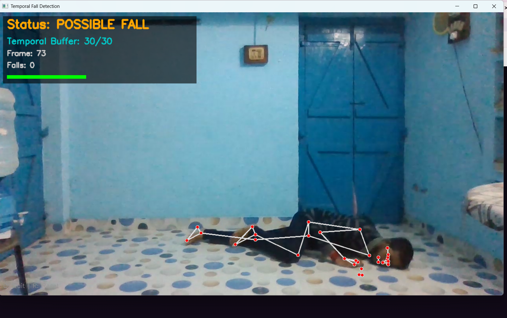
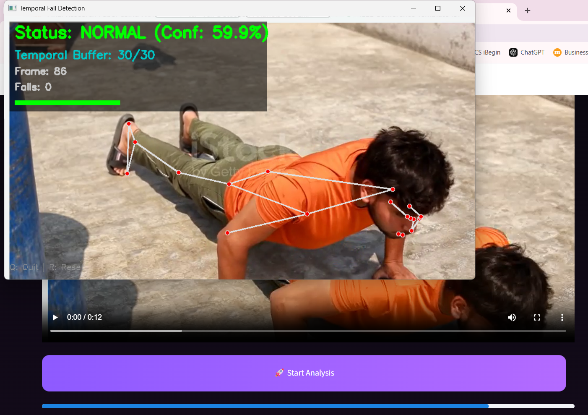

---
# 🛡️ FallGuard AI — Human Fall Detection System from Video Sequences

A real-time human fall detection system using temporal pose analysis and machine learning. Built with MediaPipe, OpenCV, and Random Forest — deployed as an interactive Streamlit web app.

---

## 📌 Project Description

FallGuard AI detects human falls in real-time by analyzing body movement patterns over time. Instead of looking at a single frame, it analyzes a 1-second sliding window of 30 frames to capture motion dynamics like velocity, acceleration, torso angle, and body aspect ratio. When a fall is detected, the system triggers an audio alert and sends an email notification instantly.

The goal is to assist in Healthcare & Hospitals, Elderly care, Industrial & Workplace Safety , Schools & Special Care Facilities by providing timely detection and alerts.

---

## ✨ Features

- 🎥 Real-time fall detection from webcam or uploaded video
- 🦴 MediaPipe Pose for 33-landmark body tracking
- 📊 Temporal feature extraction using sliding windows
- 🌲 Random Forest classifier trained on movement patterns
- 📧 Automatic email alert on fall detection
- 🔔 Audio alarm on fall detection
- 📈 Model performance metrics dashboard
- 🕑 Analysis history tracking
- 🖥️ Clean Streamlit web interface

---

## 🗂️ Dataset

This project uses the **GMDCSA24 Dataset** — A Dataset for Human Fall Detection in Videos.

- 4 subjects performing activities
- 2 action categories: **ADL** (Activities of Daily Living) and **Fall**


> Dataset link: [GMDCSA24](https://github.com/ekramalam/GMDCSA24-A-Dataset-for-Human-Fall-Detection-in-Videos)

---

## 🤖 Model Details

| Property | Details |
|---|---|
| Model | Random Forest Classifier |
| Features | 26 temporal features per window |
| Window size | 30 frames (~1 second at 30fps) |
| Window overlap | 50% (step size = 15 frames) |
| Training split | 80% train / 20% test (group-wise by video) |

### Key Features Used
- Average & peak velocity
- Torso angle mean, std, max
- Body aspect ratio
- Ground contact (ankle position)
- Movement jerk (acceleration change)
- Statistical moments (x, y, z coordinates)

### Performance

| Metric | Score |
|---|---|
| Accuracy | 95.74% |
| Precision | 95.81% |
| Recall | 93.90% |
| F1-Score | 94.85% |
| ROC AUC | ~0.99 |

---

## ⚙️ Setup & Installation

### 1. Clone the repository
```bash
git clone https://github.com/yourusername/fall-detection.git
cd fall-detection
```

### 2. Create a virtual environment
```bash
python -m venv venv
venv\Scripts\activate        # Windows
source venv/bin/activate     # Mac/Linux
```

### 3. Install dependencies
```bash
pip install -r requirements.txt
```

---

## 🚀 How to Run

### Option A — Run the Web App directly (model already trained)
```bash
streamlit run app.py
```

### Option B — Train the model yourself from scratch

**Step 1: Extract temporal features from the dataset**
```bash
python extract_temporal_features.py
```

**Step 2: Train the Random Forest model**
```bash
python train_temporal_model.py
```

**Step 3: Run the web app**
```bash
streamlit run app.py
```

### Option C — Run real-time detection from webcam
```bash
python main_temporal.py
```

### Option D — Run detection on a specific video
```bash
python main_temporal.py --video path/to/your/video.mp4
```

---

## 📧 Email Alert Setup

To enable email alerts, update these values in `email_alert.py`:

```python
SENDER_EMAIL = "your_email@gmail.com"
SENDER_PASSWORD = "your_app_password"   # Gmail App Password
RECEIVER_EMAIL = "receiver@gmail.com"
```

> **Note:** Use a Gmail App Password, not your regular Gmail password. Generate one at: Google Account → Security → 2-Step Verification → App Passwords

---

## 📸 Screenshots
| Upload & Detect | 

|  |   |

---

## 🛠️ Tech Stack


---

## 👩‍💻 Author

**Ruchita Joshi**  
Master of Computer Applications

---

## 📄 License

This project was developed as part of academic and self-learning efforts in Machine Learning and Computer Vision.
